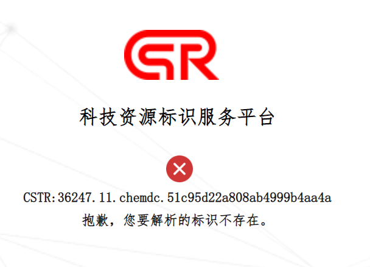

# 属性名： @id

## 1. 描述
目前以<a href="http://www.cstr.cn" target="_blank">http://www.cstr.cn/</a>[数据中心前缀]作为发布机构的@id

## 2. 需要各数据中心自己修改的内容
  * <font color="#fc5531">中国科学院东北地理与农业生态研究所所级中心</font>、<font color="#fc5531">中国科学院脑科学数据中心</font>、<font color="#fc5531">中国科学院基因组科学数据中心</font>、<font color="#fc5531">中国科学院干细胞与再生医学科学数据中心</font>用的@id全部是自己数据中心的uri，需要各自数据中心从新提交内容；
  &nbsp;
    *  示例：
        +  中国科学院东北地理与农业生态研究所所级中心: <a href="http://www.igadc.cn/info/ua034" target="_blank">http://www.igadc.cn/info/ua034</a>
        +  中国科学院脑科学数据中心: <a href="https://braindatacenter.cn/sdo/detail/5fe302d4db5dbf126cf58f88" target="_blank">https://braindatacenter.cn/sdo/detail/5fe302d4db5dbf126cf58f88</a>
        +  中国科学院基因组科学数据中心: <a href="https://ngdc.cncb.ac.cn/gsa/browse/CRA005911" target="_blank">https://ngdc.cncb.ac.cn/gsa/browse/CRA005911</a>
        +  中国科学院干细胞与再生医学科学数据中心: <a href="http://data.iscr.ac.cn/Article?id=1976cb7734814431b0220e137d34d843" target="_blank">http://data.iscr.ac.cn/Article?id=1976cb7734814431b0220e137d34d843</a>

  ***
  * <font color="#fc5531">中国科学院南京地理与湖泊研究所所级中心</font>给的@id全部是数值型数据，需要从新提交数据。
	  *  示例：148.0
  ***

  * <font color="#fc5531">中国科学院广州生物医药与健康研究所所级中心</font>给的@id全部链接到<font color="#fc5531">GIBH科学数据中心</font>的首页里，且没有给重定向，需要从新提供信息。
	  *  示例：<a href="https://doi.org/10.11922/casdc.0004190" target="_blank">https://doi.org/10.11922/casdc.0004190</a>
  ***
                             
## 3. 数据处理流程
### 3.1 新收割来的数据-数据处理流程：
1. 将<font color="#fc5531">中国科学院冰川冻土沙漠科学数据中心</font>@id中的第一个“<font color="#fc5531">CSTR:</font>”去掉，生成正确的@id
  	*  示例：https://cstr.escience.org.cn/CSTR:CSTR:11738.11.ncdc.nieer.2020.1273 转变为 <a href="https://cstr.escience.org.cn/CSTR:11738.11.ncdc.nieer.2020.1273" target="_blank">https://cstr.escience.org.cn/CSTR:11738.11.ncdc.nieer.2020.1273</a>
2. <font color="#fc5531">中国科学院生态科学数据中心</font>需要拼接上<font color="#fc5531">https://cstr.cn/</font>；

3. <font color="#fc5531">中国科学院化学化工科学数据中心</font>需要拼接上<font color="#fc5531">https://cstr.cn/</font>，如果返回不通，需要记录异常值；
&nbsp;
    *  示例：

4. 其他数据中心保持原始的@id的值。

### 3.2 科学数据中心的数据-数据处理流程：
1. 全部数据存储在t_data_resources表内的cstr字段中，如果字段值是<font color="#fc5531">undefined</font>，那么@id字段的值直接存为undefined；


 
2. 其他情况下，将字段内容拼上https://cstr.cn/，存储在@id字段中。  
    *  示例：
	      +   <a href="https://cstr.cn/11738.11.ncdc.nieer.2020.1617" target="_blank">https://cstr.cn/11738.11.ncdc.nieer.2020.1617</a>
	      +   <a href="https://cstr.cn/CSTR:15937.11.2019NCOVR" target="_blank">https://cstr.cn/CSTR:15937.11.2019NCOVR</a>
	      +   <a href="https://cstr.cn/18406.11.Meteoro.tpdc.270670" target="_blank">https://cstr.cn/18406.11.Meteoro.tpdc.270670</a>

## 4. 标准规范
```json
"@id" : "https://www.cstr.cn/18406.11.hiwater.123.2013.db",
``` 