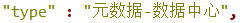

# 属性名： @type

## 1. 描述
数据资源所属的资源类型。

## 2. 元数据实例
### 2.1 新收割来的数据实例：
  * 英文名称：other
    + IRI:<a href="http://purl.org/coar/resource_type/c_1843" target="_blank">http://purl.org/coar/resource_type/c_1843</a>
  ***
  * 英文名称：patent
    + IRI:<a href="http://purl.org/coar/resource_type/c_15cd" target="_blank">http://purl.org/coar/resource_type/c_15cd</a>
  ***

  * 英文名称：research article
    + IRI:<a href="http://purl.org/coar/resource_type/c_2df8fbb1" target="_blank">http://purl.org/coar/resource_type/c_2df8fbb1</a>
  ***

  * 英文名称：book
    + IRI:<a href="http://purl.org/coar/resource_type/c_2f33" target="_blank">http://purl.org/coar/resource_type/c_2f33</a>
  ***

  * 英文名称：software patent
    + IRI:<a href="http://purl.org/coar/resource_type/MW8G-3CR8" target="_blank">http://purl.org/coar/resource_type/MW8G-3CR8</a>

<a id="jump1"></a>
### 2.2 科学数据中心的数据实例：
  - 原始名称：服务工具-数据中心
    * 英文名称：software
	    + IRI：<a href="http://purl.org/coar/resource_type/c_5ce6" target="_blank">http://purl.org/coar/resource_type/c_5ce6</a>
  ***

  - 原始名称：元数据-数据中心
    * 英文名称：Dataset
	    + IRI：<a href="https://schema.org/Dataset" target="_blank">https://schema.org/Dataset</a>
  ***

  - 原始名称：服务工具-数据中心
    * 英文名称：software
	    + IRI：<a href="http://purl.org/coar/resource_type/c_5ce6" target="_blank">http://purl.org/coar/resource_type/c_5ce6</a>
  ***

  - 原始名称：数据论文
    * 英文名称：DataPaper
	    + IRI：<a href="http://datacite.org/schema/kernel-4/DataPaper" target="_blank">http://datacite.org/schema/kernel-4/DataPaper</a>
  ***

  - 原始名称：标准信息-数据中心
    * 说明：由刘老师新增加类型。
  ***

  - 原始名称：论文
    * 说明：没有论文这个具体的描述项。
  ***

  - 原始名称：数据应用服务系统
    * 英文名称：software
	    + IRI：<a href="http://purl.org/coar/resource_type/c_5ce6" target="_blank">http://purl.org/coar/resource_type/c_5ce6</a>
  ***

  - 原始名称：引证论文
    * 说明：没有论文这个具体的描述项。
  ***

  - 原始名称：著作-数据中心
    * 英文名称：book
	    + IRI：<a href="http://purl.org/coar/resource_type/c_2f33" target="_blank">http://purl.org/coar/resource_type/c_2f33</a>
  ***

  - 原始名称：专利与软件著作权信息-数据中心
    * 英文名称：patent & softwarePatent
	    + IRI：<a href="http://purl.org/coar/resource_type/c_15cd" target="_blank">http://purl.org/coar/resource_type/c_15cd</a> & <a href="http://purl.org/coar/resource_type/MW8G-3CR8" target="_blank">http://purl.org/coar/resource_type/MW8G-3CR8</a>
  ***
                             
## 3. 数据处理流程
### 3.1 新收割来的数据-数据处理流程：
1. 如果出现值dcmi:Dataset，将其转化为<a href="http://purl.org/dc/dcmitype/Dataset" target="_blank">http://purl.org/dc/dcmitype/Dataset</a>。并以string的形式存储在@type字段中；
2. 如果值中没有“http://”在其中，那么记下整条数据的信息，存储在文档中，进行人工核验；
3. 如果没有前边的两步问题，直接以string的形式存储在@type字段中。

### 3.2 科学数据中心的数据-数据处理流程：
1. 全部数据存储在t_data_resources表内的type字段中，按照[2.2](#jump1)里的内容将对应的原始名称转化为相应的IRI。  
    &nbsp;
    *  示例：

## 4. 标准规范
```json
"@type" : "http://purl.org/dc/dcmitype/Dataset",
``` 